# Game logic

This project's objective is to create a multiplayer card game with up to four players that uses a variety of cards, including action and number cards. Each player receives a hand of five cards at the start of the game from a deck of 52 regular playing cards.

Following particular rules on which cards can be played at certain moments, participants take turns playing cards from their hands as the game is being played. A card must either match the suit or rank of the top card on the discard pile in order to be played.

A player must draw a card from the draw pile if they are unable to play a card. The game concludes in a draw if the draw pile is empty, and neither player is crowned the winner. The only time the game is over is when one person runs out of cards and is declared the winner.

The game also has unique action cards, such as Aces, Kings, Queens, and Jacks. A specific action is carried out when one of these action cards is played. For instance, playing an Ace skips the turn of the following player, while playing a King flips the order of play. When a Queen is played, the following player draws two cards, and when a Jack is played, the following player draws four cards. Because actions cannot be stacked, if a Queen is played by one player, even if that person has another Queen in their hand, they cannot be played by the following player.

## Program execution steps

You can begin by cloning the repository onto your own system before running the programme. Once you've done that, use the command "Main.main()" to access the Main class and perform its main function. A minimum of 2 players and a maximum of 4 players will then be asked to enter the number of players they wish to play the game with. Any environment that supports Java 1.8 or above should allow the programme to execute without any issues. We appreciate your use of this programme!

Thank you!

## Screenshots

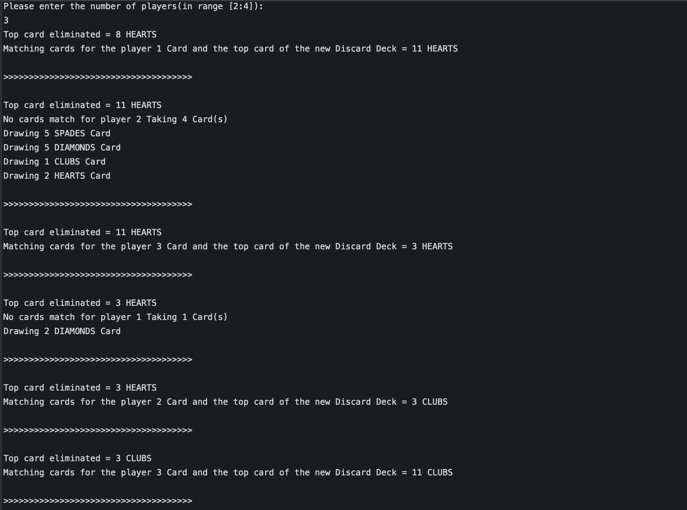

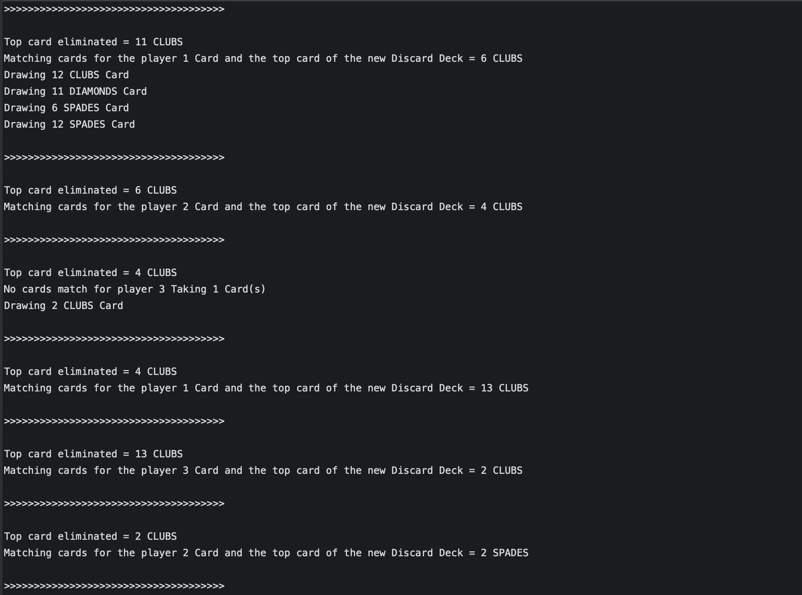

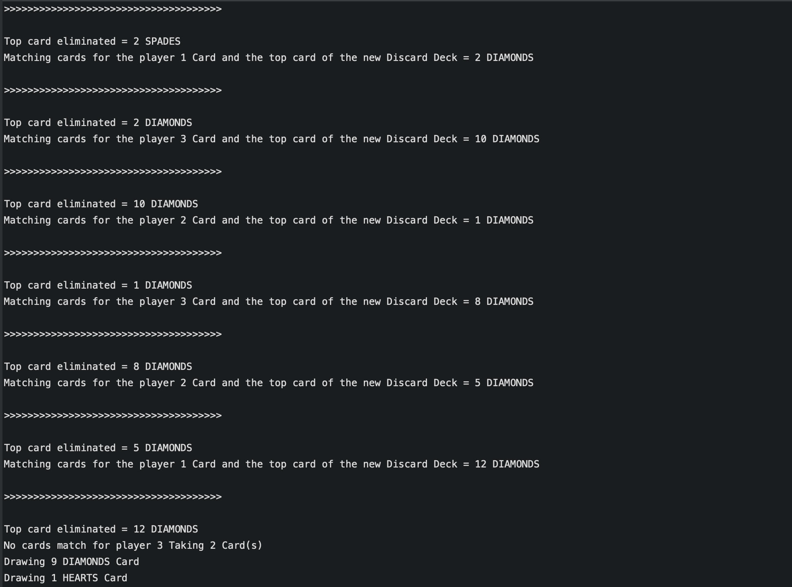

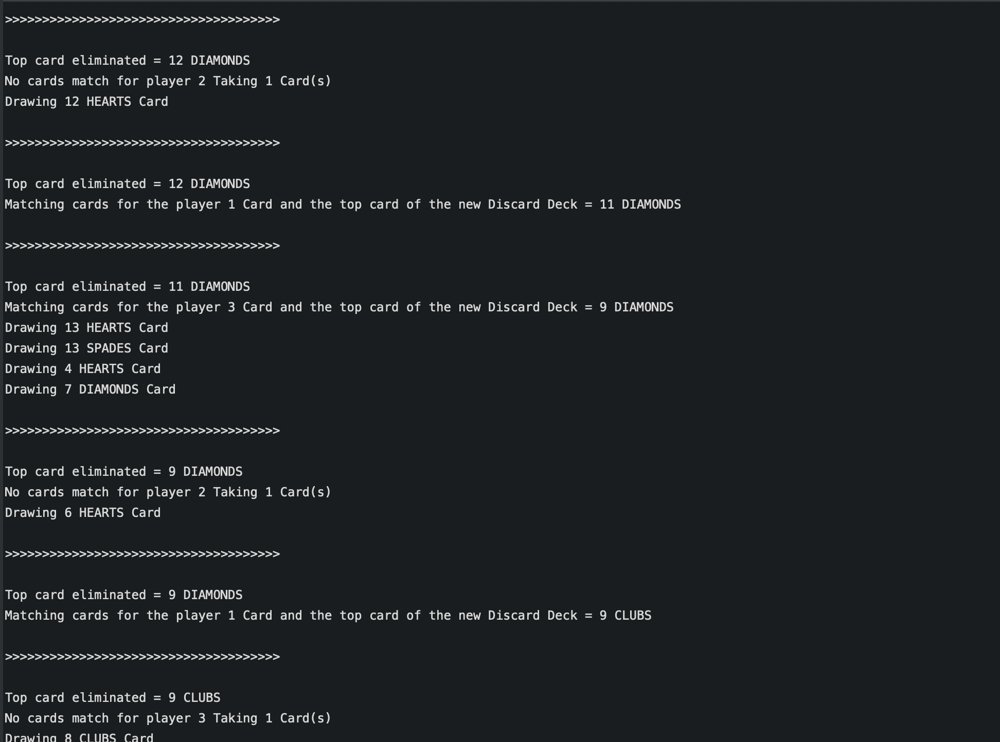

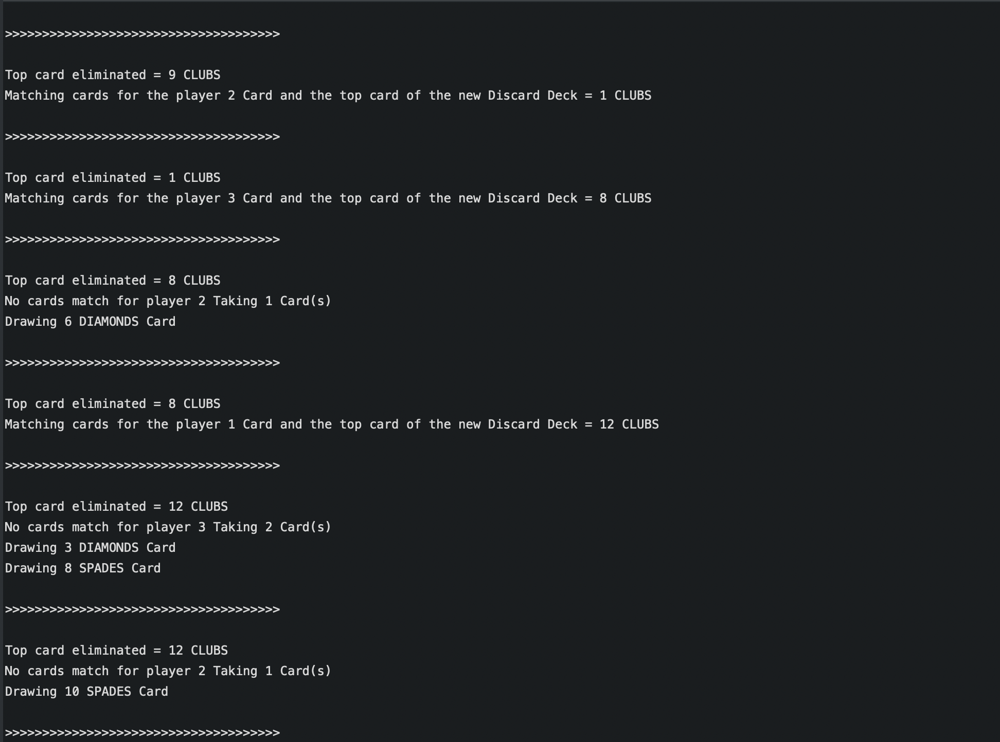

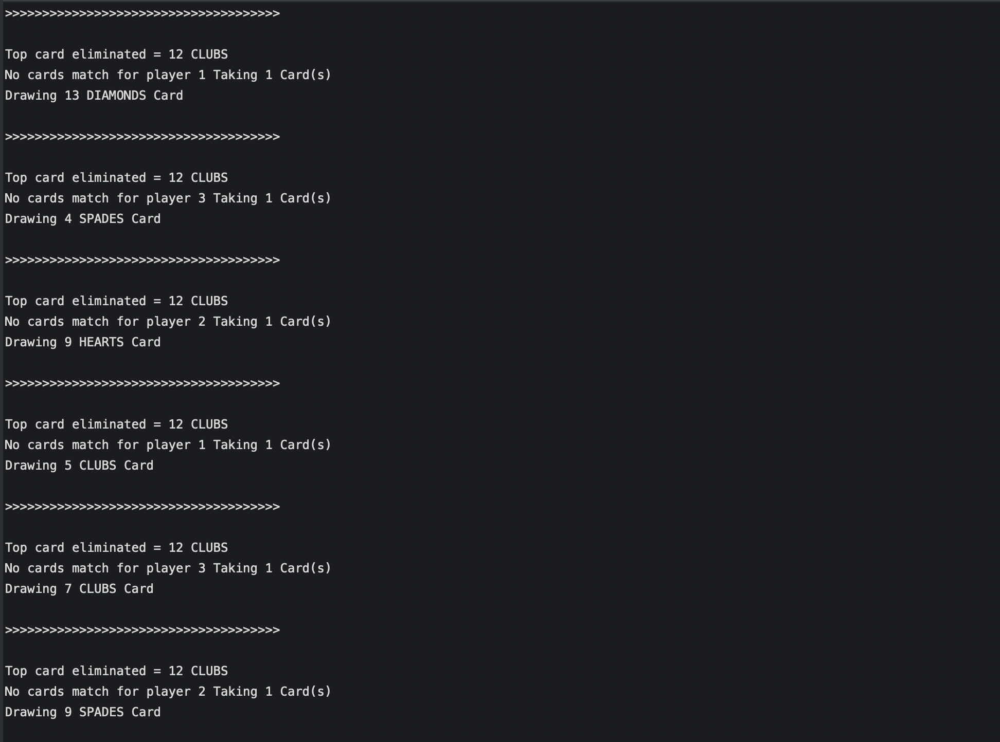

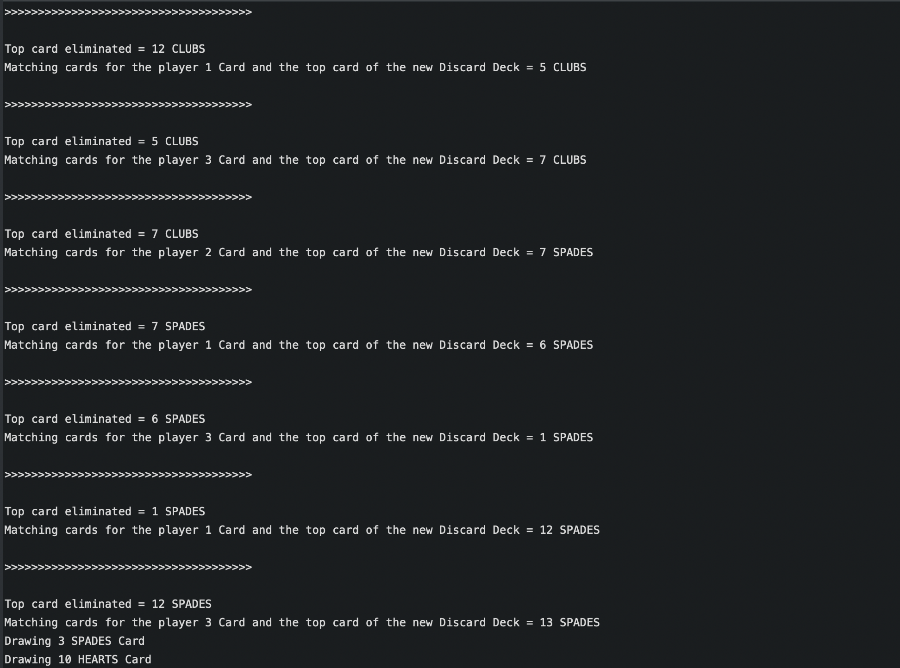

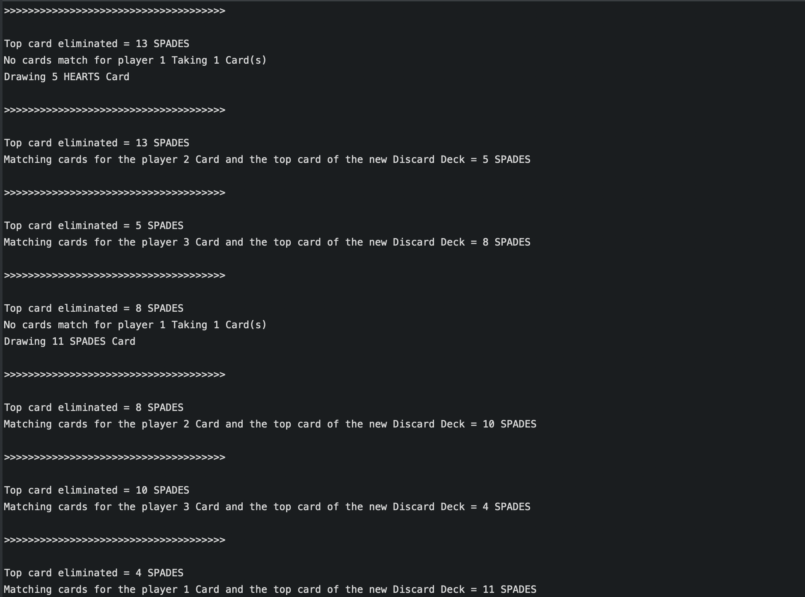

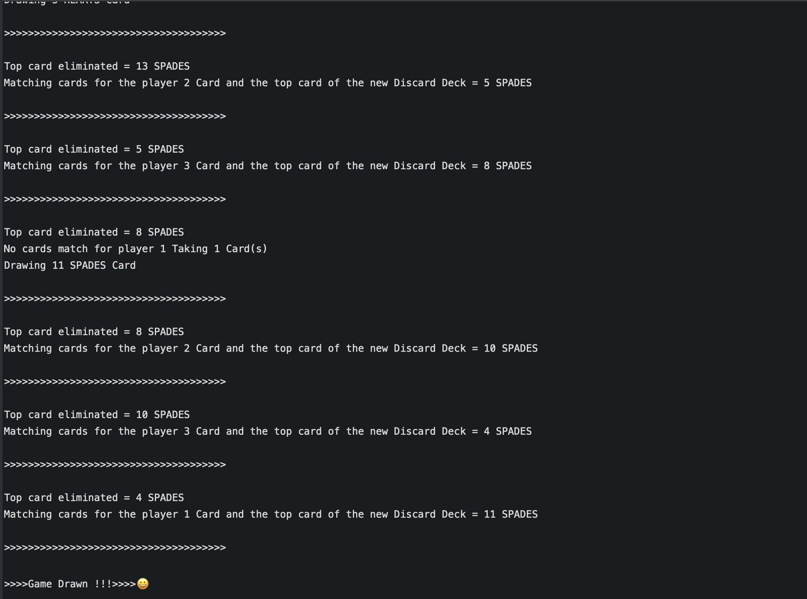

## Test Screenshots

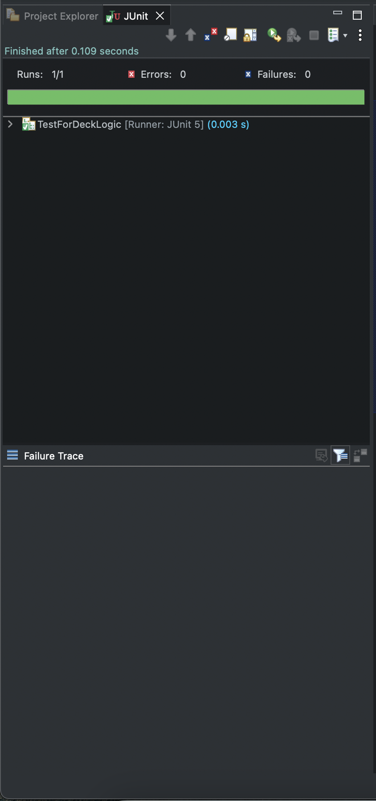

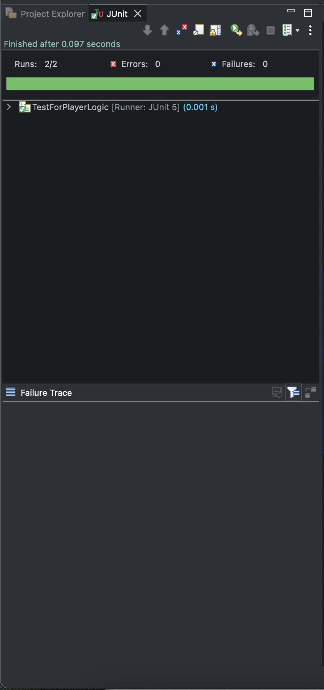

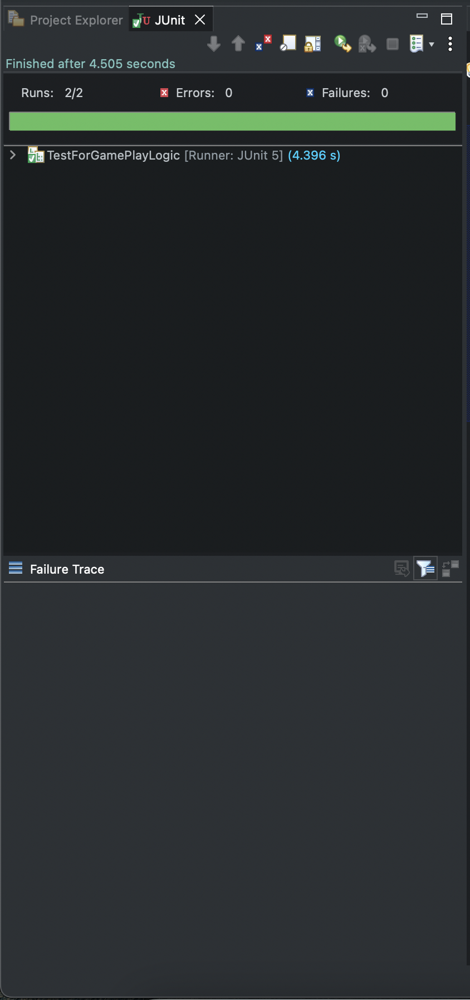

## Author

- [Sasank Sah](https://github.com/sankytech12)
- [LinkedIn](https://www.linkedin.com/in/sasank-sah-2301a5227/)
- Email : sah.sasank12@gmail.com

